<a href="https://4lltools.morizdigital.com">
  <picture>
    <source media="(prefers-color-scheme: dark)" srcset="docs/readme/banner-dark.svg">
    
  </picture>
</a>

<p align="center">
  <a href="https://4lltools.morizdigital.com"><b>Open the site</b></a> ·
  <a href="#-simulation-gallery">Gallery</a> ·
  <a href="#-all-200-tools">All tools</a> ·
  <a href="#-how-it-works">How it works</a> ·
  <a href="#-the-simulation-kit">Simulation kit</a> ·
  <a href="#-add-a-new-tool">Add a tool</a> ·
  <a href="#-deploy">Deploy</a>
</p>

<p align="center">
  <a href="https://github.com/mrzkprtm/4llTools/actions/workflows/ci.yml"></a>
  
  
  
  
  
  
</p>

**4llTools** is a pocket workbench: **100 everyday tools** (QR codes, JSON, PDFs, images, passwords, calculators…) and **100 interactive simulations** of physics, math, algorithms, science and generative art. Every tool runs entirely in your browser. There's no sign-up, no upload, and nothing you type is sent anywhere.

<picture>
  <source media="(prefers-color-scheme: dark)" srcset="docs/readme/screens/home-dark.webp">
  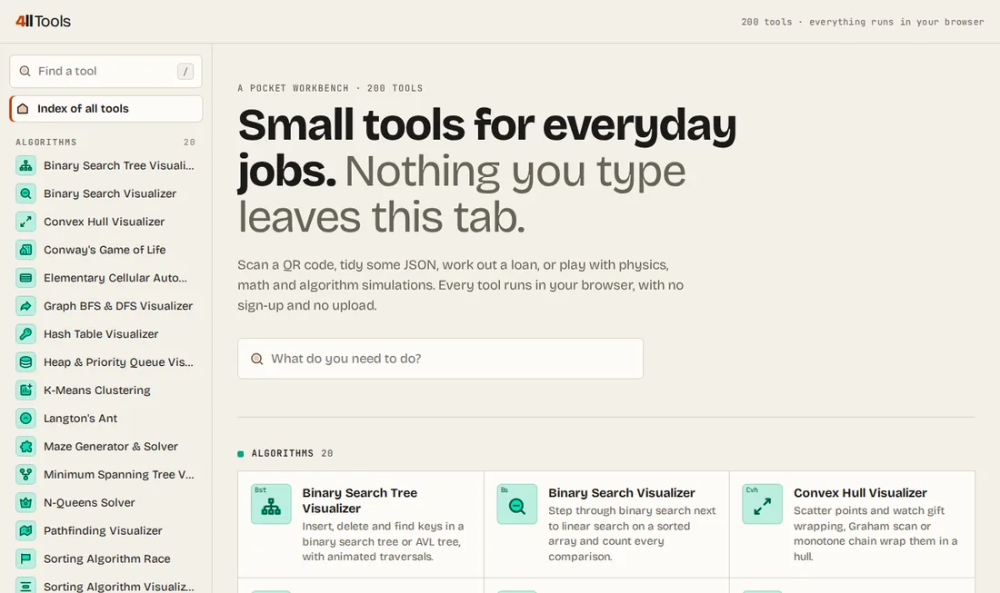
</picture>

## ✨ Highlights

| | |
| --- | --- |
| 🔒 **Private by design** | Text, files, images, camera and microphone are processed on your device. The few tools that must use the network (DNS lookup, CORS checker, live URL check, speech to text) say exactly what they send, and to whom. |
| 🎬 **Live simulations** | 100 canvas simulations you can poke at: drag pendulums, paint walls for A\*, fling planets, stir smoke, breed pea plants, train a neural network. |
| ⚡ **Fast** | Each tool's code loads only when you open it, so 200 tools cost the home page nothing. Every page is prerendered to HTML at build time. |
| 🌗 **Light & dark** | A warm-paper theme that follows your system setting, including every canvas. |
| ♿ **Motion-aware** | Spring animations everywhere, but simulations start paused and effects stay still when you ask your system for reduced motion. |
| 🔎 **Found by search** | Per-page titles, descriptions, share images, JSON-LD, FAQs, sitemap, `robots.txt` and `llms.txt`, all generated from each tool's metadata. |
| 🧩 **Drop-in tools** | A tool is one folder. Add `meta.ts` and `Tool.tsx` and it appears in the sidebar, home page, search, sitemap and prerender with no central list to edit. |

## 🎬 Simulation gallery

Real recordings from the site. Click any one to open it.

<table>
  <tr>
    <td width="25%" align="center"><a href="https://4lltools.morizdigital.com/double-pendulum">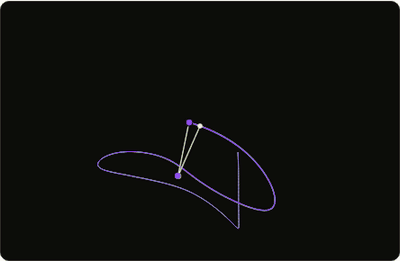</a><br><sub><b>Double Pendulum Chaos</b><br>Physics</sub></td>
    <td width="25%" align="center"><a href="https://4lltools.morizdigital.com/wave-interference">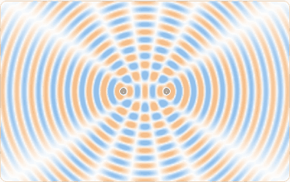</a><br><sub><b>Wave Interference</b><br>Physics</sub></td>
    <td width="25%" align="center"><a href="https://4lltools.morizdigital.com/orbit-simulator">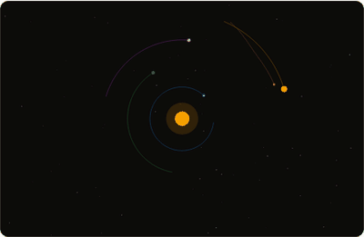</a><br><sub><b>Orbit & Gravity</b><br>Physics</sub></td>
    <td width="25%" align="center"><a href="https://4lltools.morizdigital.com/fluid-smoke">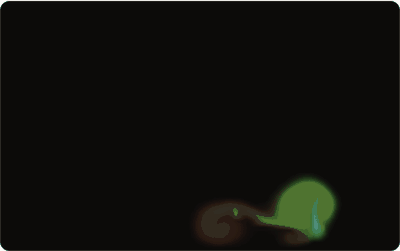</a><br><sub><b>Fluid & Smoke</b><br>Physics</sub></td>
  </tr>
  <tr>
    <td align="center"><a href="https://4lltools.morizdigital.com/fourier-drawing">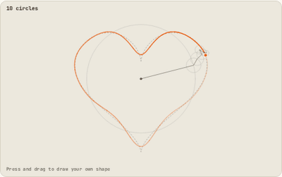</a><br><sub><b>Fourier Epicycles</b><br>Math</sub></td>
    <td align="center"><a href="https://4lltools.morizdigital.com/galton-board">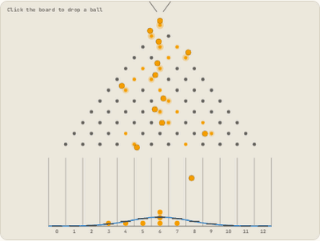</a><br><sub><b>Galton Board</b><br>Math</sub></td>
    <td align="center"><a href="https://4lltools.morizdigital.com/sorting-visualizer">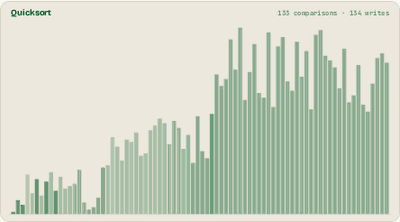</a><br><sub><b>Sorting Visualizer</b><br>Algorithms</sub></td>
    <td align="center"><a href="https://4lltools.morizdigital.com/pathfinding-visualizer">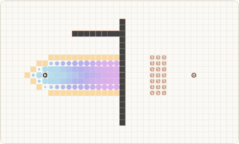</a><br><sub><b>Pathfinding (A*)</b><br>Algorithms</sub></td>
  </tr>
  <tr>
    <td align="center"><a href="https://4lltools.morizdigital.com/maze-generator">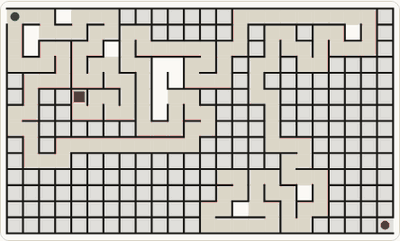</a><br><sub><b>Maze Generator</b><br>Algorithms</sub></td>
    <td align="center"><a href="https://4lltools.morizdigital.com/game-of-life">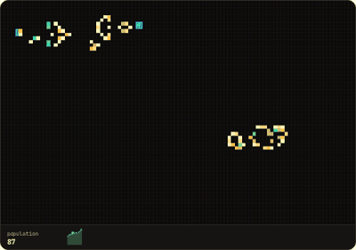</a><br><sub><b>Game of Life</b><br>Algorithms</sub></td>
    <td align="center"><a href="https://4lltools.morizdigital.com/flocking-boids">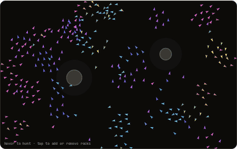</a><br><sub><b>Flocking Boids</b><br>Science</sub></td>
    <td align="center"><a href="https://4lltools.morizdigital.com/epidemic-simulator">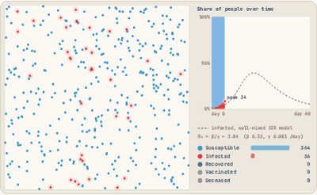</a><br><sub><b>Epidemic (SIR)</b><br>Science</sub></td>
  </tr>
  <tr>
    <td align="center"><a href="https://4lltools.morizdigital.com/reaction-diffusion"></a><br><sub><b>Reaction–Diffusion</b><br>Science</sub></td>
    <td align="center"><a href="https://4lltools.morizdigital.com/flow-field-art">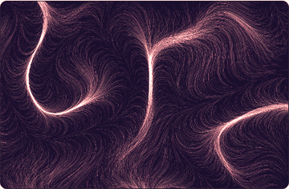</a><br><sub><b>Flow Field Art</b><br>Art</sub></td>
    <td align="center"><a href="https://4lltools.morizdigital.com/fireworks"></a><br><sub><b>Fireworks</b><br>Art</sub></td>
    <td align="center"><a href="https://4lltools.morizdigital.com/matrix-rain">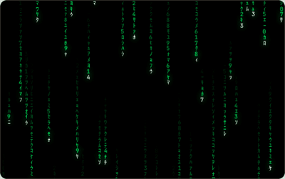</a><br><sub><b>Digital Rain</b><br>Art</sub></td>
  </tr>
</table>

## 🧰 All 200 tools

<picture>
  <source media="(prefers-color-scheme: dark)" srcset="docs/readme/categories-dark.svg">
  
</picture>

Click a category to expand it. Every name links to the live tool.

<!-- tools:start -->
#### Simulations (100)

<details>
<summary><b>🧮 Algorithms</b> · 20 tools · ★ interactive simulations</summary>

| | Tool | What it does |
| :-: | --- | --- |
| `Bst` | [Binary Search Tree Visualizer](https://4lltools.morizdigital.com/bst-visualizer) | Insert, delete and find keys in a binary search tree or AVL tree, with animated traversals |
| `Bs` | [Binary Search Visualizer](https://4lltools.morizdigital.com/binary-search) | Step through binary search next to linear search on a sorted array and count every comparison |
| `Cvh` | [Convex Hull Visualizer](https://4lltools.morizdigital.com/convex-hull) | Scatter points and watch gift wrapping, Graham scan or monotone chain wrap them in a hull |
| `Gol` | [Conway's Game of Life](https://4lltools.morizdigital.com/game-of-life) | Draw cells or drop in gliders and guns, then run Conway's Game of Life at any speed |
| `Ca` | [Elementary Cellular Automata](https://4lltools.morizdigital.com/cellular-automaton) | Explore all 256 Wolfram rules, like Rule 30 and Rule 110, as they grow line by line |
| `Gt` | [Graph BFS & DFS Visualizer](https://4lltools.morizdigital.com/graph-traversal) | Build a graph by clicking, drag its nodes around and watch breadth-first and depth-first search run |
| `Ht` | [Hash Table Visualizer](https://4lltools.morizdigital.com/hash-table) | Insert keys into a hash table with chaining or open addressing and watch collisions and resizing |
| `Hp` | [Heap & Priority Queue Visualizer](https://4lltools.morizdigital.com/heap-visualizer) | Push and pop a binary heap and watch items sift up and down in both the tree and the array |
| `Km` | [K-Means Clustering](https://4lltools.morizdigital.com/k-means-clustering) | Scatter points and watch k-means move its centroids and recolor clusters until it converges |
| `La` | [Langton's Ant](https://4lltools.morizdigital.com/langtons-ant) | Watch Langton's ant and multi-color turmites build chaos and highways from simple rules |
| `Mz` | [Maze Generator & Solver](https://4lltools.morizdigital.com/maze-generator) | Generate mazes with backtracking, Prim's or Kruskal's algorithm, then watch them get solved |
| `Mst` | [Minimum Spanning Tree Visualizer](https://4lltools.morizdigital.com/minimum-spanning-tree) | Watch Kruskal's and Prim's algorithms pick the cheapest edges that connect every node |
| `Nq` | [N-Queens Solver](https://4lltools.morizdigital.com/n-queens) | Watch backtracking place N queens on a chessboard so that no two queens attack each other |
| `A*` | [Pathfinding Visualizer](https://4lltools.morizdigital.com/pathfinding-visualizer) | Draw walls and weights, then watch A*, Dijkstra, BFS and DFS search a grid for the shortest path |
| `Sra` | [Sorting Algorithm Race](https://4lltools.morizdigital.com/sorting-race) | Race sorting algorithms side by side on the same shuffled data and see which one finishes first |
| `So` | [Sorting Algorithm Visualizer](https://4lltools.morizdigital.com/sorting-visualizer) | Watch bubble, quick, merge, heap, radix and more sorts animate with sound, compares and swaps |
| `Stq` | [Stack & Queue Visualizer](https://4lltools.morizdigital.com/stack-queue) | Push, pop, enqueue and dequeue items and see how LIFO stacks and FIFO queues behave |
| `Su` | [Sudoku Solver](https://4lltools.morizdigital.com/sudoku-solver) | Type in a Sudoku or load one, then watch backtracking with constraint checks fill it in |
| `Th` | [Tower of Hanoi](https://4lltools.morizdigital.com/tower-of-hanoi) | Play the Tower of Hanoi yourself or watch the recursive solution move up to 10 disks |
| `Tsp` | [Traveling Salesman Solver](https://4lltools.morizdigital.com/traveling-salesman) | Place cities and watch nearest neighbor, 2-opt and simulated annealing shorten the tour |

</details>

<details>
<summary><b>🎨 Art</b> · 20 tools · ★ interactive simulations</summary>

| | Tool | What it does |
| :-: | --- | --- |
| `Tg` | [3D Terrain Flyover](https://4lltools.morizdigital.com/terrain-generator) | Fly over endless procedural terrain made from Perlin noise, as a neon wireframe or shaded hills |
| `Av` | [Audio Visualizer](https://4lltools.morizdigital.com/audio-visualizer) | See your microphone or a test tone as spectrum bars, a waveform or a radial visual in real time |
| `Cpk` | [Circle Packing Generator](https://4lltools.morizdigital.com/circle-packing) | Grow non-overlapping circles until they fill the canvas or a word, then save the pattern as PNG |
| `Fsd` | [Falling Sand Game](https://4lltools.morizdigital.com/falling-sand) | Pour sand, water, stone, fire and plants into a pixel sandbox and watch them interact |
| `Fw` | [Fireworks Simulator](https://4lltools.morizdigital.com/fireworks) | Tap the sky to launch fireworks with peonies, rings and willows, or let an automatic show run |
| `Ffa` | [Flow Field Art Generator](https://4lltools.morizdigital.com/flow-field-art) | Let thousands of particles trace a Perlin noise flow field into generative art, then save a PNG |
| `Hg` | [Harmonograph](https://4lltools.morizdigital.com/harmonograph) | Simulate a pendulum drawing machine whose decaying swings draw delicate harmonograph figures |
| `Kd` | [Kaleidoscope Drawing Pad](https://4lltools.morizdigital.com/kaleidoscope-draw) | Draw with mirrored symmetry in 2 to 24 slices to make mandalas and kaleidoscope patterns |
| `Ls` | [L-System Plant Generator](https://4lltools.morizdigital.com/l-system-plants) | Grow ferns, bushes, snowflakes and dragon curves from L-system rules with an animated turtle |
| `Mr` | [Matrix Digital Rain](https://4lltools.morizdigital.com/matrix-rain) | Make falling green code rain with your own characters, colors, speed and density |
| `Mt` | [Metaballs Lava Lamp](https://4lltools.morizdigital.com/metaballs) | Watch blobby metaballs merge and split like a lava lamp, drag them around and pick the colors |
| `Pp` | [Particle Playground](https://4lltools.morizdigital.com/particle-playground) | Spray particles from fountains, place attractors and repellers, and tweak gravity and color |
| `Ph` | [Phyllotaxis Sunflower Pattern](https://4lltools.morizdigital.com/phyllotaxis) | Grow sunflower and pinecone spirals from the golden angle and see what other angles do instead |
| `Ro` | [Polar Rose Curve Generator](https://4lltools.morizdigital.com/rose-curves) | Trace animated rose curves r = cos(kθ) and other polar patterns with adjustable petals |
| `Hc` | [Space-Filling Curve Drawer](https://4lltools.morizdigital.com/space-filling-curves) | Draw Hilbert, Peano, Moore and Z-order curves level by level with an animated pen |
| `Tp` | [Text Particle Effect](https://4lltools.morizdigital.com/text-particles) | Turn any word into particles that scatter away from your cursor and spring back into place |
| `Tt` | [Times Table Circle](https://4lltools.morizdigital.com/times-table-circle) | Connect points around a circle by multiplying mod n and watch cardioids and nephroids morph |
| `Tru` | [Truchet Tile Pattern Generator](https://4lltools.morizdigital.com/truchet-tiles) | Generate Truchet tile patterns with arcs, diagonals and triangles that flip in rippling waves |
| `Vo` | [Voronoi Diagram Generator](https://4lltools.morizdigital.com/voronoi-diagram) | Drag seeds and watch Voronoi cells and the Delaunay triangulation update as the seeds drift |
| `Wr` | [Water Ripple Pond](https://4lltools.morizdigital.com/water-ripples) | Touch a pond to make ripples that spread, bounce and interfere, with rain and drag trails |

</details>

<details>
<summary><b>📐 Math</b> · 20 tools · ★ interactive simulations</summary>

| | Tool | What it does |
| :-: | --- | --- |
| `Mx` | [2D Matrix Transformation Visualizer](https://4lltools.morizdigital.com/matrix-transform) | Watch a 2×2 matrix warp the plane, with its determinant, eigenvectors and a morphing grid |
| `Fx` | [Animated Function Grapher](https://4lltools.morizdigital.com/function-grapher) | Plot functions of x with sliders and a time variable t, and watch the graphs morph live |
| `Bz` | [Bézier Curve Construction](https://4lltools.morizdigital.com/bezier-construction) | Drag control points and watch de Casteljau's algorithm build a Bézier curve step by step |
| `Clt` | [Central Limit Theorem Simulator](https://4lltools.morizdigital.com/central-limit) | Draw samples from skewed distributions and watch their averages settle into a normal curve |
| `Cg` | [Chaos Game Fractals](https://4lltools.morizdigital.com/chaos-game) | Play the chaos game with 3 to 8 corners and watch the Sierpinski triangle and more appear |
| `Cz` | [Collatz Conjecture Visualizer](https://4lltools.morizdigital.com/collatz-conjecture) | Follow the 3n + 1 sequence for any number and grow the branching Collatz tree of many values |
| `Fe` | [Fourier Epicycle Drawing](https://4lltools.morizdigital.com/fourier-drawing) | Draw any shape and watch spinning Fourier circles trace it back, one frequency at a time |
| `Fs` | [Fourier Series Wave Builder](https://4lltools.morizdigital.com/fourier-series) | Build square, sawtooth and triangle waves from rotating circles and watch each harmonic add up |
| `Tr` | [Fractal Tree Generator](https://4lltools.morizdigital.com/fractal-tree) | Grow a recursive fractal tree, bend its branches with sliders and let it sway in the wind |
| `Gb` | [Galton Board](https://4lltools.morizdigital.com/galton-board) | Drop balls through a pegboard and watch the bell curve of the binomial distribution build up |
| `Lj` | [Lissajous Curve Generator](https://4lltools.morizdigital.com/lissajous-curves) | Draw animated Lissajous figures from two oscillations with any frequency ratio and phase shift |
| `Mj` | [Mandelbrot & Julia Set Explorer](https://4lltools.morizdigital.com/mandelbrot-explorer) | Zoom deep into the Mandelbrot set and preview the Julia set that belongs to any point |
| `Pi` | [Monte Carlo Pi Estimator](https://4lltools.morizdigital.com/monte-carlo-pi) | Throw random darts at a square and watch the estimate of π converge as they land in the circle |
| `Us` | [Prime Number Spiral](https://4lltools.morizdigital.com/ulam-spiral) | Watch prime numbers light up on the Ulam and Sacks spirals as the integers wind outward |
| `Rwk` | [Random Walk & Brownian Motion](https://4lltools.morizdigital.com/random-walk) | Release random walkers in 1D, 2D or on a lattice and compare how far they spread with √n |
| `Ri` | [Riemann Sum Visualizer](https://4lltools.morizdigital.com/riemann-sums) | Approximate the area under a curve with left, right, midpoint and trapezoid sums as n grows |
| `Sp` | [Spirograph](https://4lltools.morizdigital.com/spirograph) | Roll gears inside and outside a ring to draw spirograph patterns, then save them as PNG |
| `Tay` | [Taylor Series Approximation](https://4lltools.morizdigital.com/taylor-series) | Add Taylor polynomial terms one by one and watch them hug sin, cos, eˣ and ln around a point |
| `Uc` | [Unit Circle & Trig Visualizer](https://4lltools.morizdigital.com/unit-circle) | Spin an angle around the unit circle and watch sine, cosine and tangent unroll into waves |
| `Vf` | [Vector Field Visualizer](https://4lltools.morizdigital.com/vector-field) | Type a 2D vector field and watch particles stream along it, with arrows, curl and divergence |

</details>

<details>
<summary><b>🪐 Physics</b> · 20 tools · ★ interactive simulations</summary>

| | Tool | What it does |
| :-: | --- | --- |
| `Lz` | [Charged Particle in a Magnetic Field](https://4lltools.morizdigital.com/lorentz-force) | Fire charged particles through magnetic and electric fields and watch them spiral and drift |
| `Cth` | [Cloth Simulation](https://4lltools.morizdigital.com/cloth-simulation) | Pull, blow and tear a sheet of cloth made of springs, with gravity and gusting wind |
| `Co` | [Collision Lab](https://4lltools.morizdigital.com/collision-lab) | Crash balls together with elastic or sticky collisions and check that momentum is conserved |
| `Dop` | [Doppler Effect Visualizer](https://4lltools.morizdigital.com/doppler-effect) | Move a sound source and watch wavefronts bunch up, the pitch shift and a sonic boom past Mach 1 |
| `Dp` | [Double Pendulum Chaos](https://4lltools.morizdigital.com/double-pendulum) | Watch two nearly identical double pendulums drift apart into chaos, with glowing trails |
| `Ef` | [Electric Field Simulator](https://4lltools.morizdigital.com/electric-field) | Drag positive and negative charges and see field lines, equipotentials and a test charge move |
| `Fl` | [Fluid & Smoke Simulator](https://4lltools.morizdigital.com/fluid-smoke) | Stir a real-time fluid with your mouse or finger and watch swirling colored smoke follow the flow |
| `Hd` | [Heat Diffusion Simulator](https://4lltools.morizdigital.com/heat-diffusion) | Paint hot and cold spots on a metal plate and watch heat spread and even out over time |
| `Pv` | [Ideal Gas Simulator](https://4lltools.morizdigital.com/ideal-gas) | Heat, squeeze and fill a box of gas particles and watch pressure, temperature and speeds change |
| `Ra` | [Inclined Plane & Friction](https://4lltools.morizdigital.com/inclined-plane) | Slide a block down a ramp, change the angle and friction, and see force vectors and acceleration |
| `Lr` | [Lens & Mirror Ray Tracer](https://4lltools.morizdigital.com/lens-ray-tracer) | Drag an object past a lens or mirror and watch the principal rays form a real or virtual image |
| `Nc` | [Newton's Cradle](https://4lltools.morizdigital.com/newtons-cradle) | Lift balls of a Newton's cradle and watch momentum and energy travel through the row |
| `Ob` | [Orbit & Gravity Simulator](https://4lltools.morizdigital.com/orbit-simulator) | Fling planets and moons around a star and watch gravity bend their paths into elliptical orbits |
| `Pd` | [Pendulum Lab](https://4lltools.morizdigital.com/pendulum-lab) | Swing a pendulum, change its length, gravity and damping, and watch its period and energy change |
| `Pm` | [Projectile Motion Simulator](https://4lltools.morizdigital.com/projectile-motion) | Launch projectiles at any angle and speed, add air drag and see range, height and flight time live |
| `RC` | [RC Circuit Simulator](https://4lltools.morizdigital.com/rc-circuit) | Charge and discharge a capacitor through a resistor and watch voltage, current and the time constant |
| `Sn` | [Snell's Law Refraction](https://4lltools.morizdigital.com/snells-law) | Aim a laser across two materials and see refraction, partial reflection and total internal reflection |
| `Ks` | [Spring & Mass Oscillator](https://4lltools.morizdigital.com/spring-mass) | Stretch a spring, tune stiffness, mass, damping and driving force, and watch resonance in real time |
| `Sw` | [Standing Waves on a String](https://4lltools.morizdigital.com/standing-waves) | Vibrate a string at its harmonics, hear the tone and see nodes, antinodes and each frequency |
| `Wi` | [Wave Interference Ripple Tank](https://4lltools.morizdigital.com/wave-interference) | Drag wave sources around a ripple tank and watch interference fringes form in real time |

</details>

<details>
<summary><b>🧬 Science</b> · 20 tools · ★ interactive simulations</summary>

| | Tool | What it does |
| :-: | --- | --- |
| `Mol` | [3D Molecule Viewer](https://4lltools.morizdigital.com/molecule-viewer) | Rotate 3D ball-and-stick models of water, methane, caffeine and more, with bond angles |
| `Ac` | [Ant Colony Simulator](https://4lltools.morizdigital.com/ant-colony) | Watch ants find food by laying and following pheromone trails, and draw walls to block them |
| `At` | [Atom Builder](https://4lltools.morizdigital.com/atom-builder) | Add protons, neutrons and electrons to build any element, ion or isotope on an animated Bohr model |
| `Eq` | [Chemical Equilibrium Simulator](https://4lltools.morizdigital.com/reaction-equilibrium) | Collide molecules in A + B ⇌ C + D and watch the reaction settle into equilibrium as you heat it |
| `Dif` | [Diffusion & Osmosis Simulator](https://4lltools.morizdigital.com/diffusion-membrane) | Watch particles diffuse through a semipermeable membrane until the concentrations even out |
| `Dna` | [DNA Transcription & Translation](https://4lltools.morizdigital.com/dna-transcription) | Type a DNA strand and watch it unzip, transcribe into mRNA and translate into amino acids |
| `Sir` | [Epidemic Simulator (SIR)](https://4lltools.morizdigital.com/epidemic-simulator) | Watch an outbreak spread through a moving crowd and flatten the curve with distancing and vaccines |
| `Bd` | [Flocking Birds (Boids)](https://4lltools.morizdigital.com/flocking-boids) | Tune separation, alignment and cohesion and watch a flock of boids swarm and flee a hawk |
| `Fir` | [Forest Fire Simulator](https://4lltools.morizdigital.com/forest-fire) | Grow a forest, strike lightning and watch fires spread, with tree density, wind and regrowth |
| `Ga` | [Genetic Algorithm Phrase Evolver](https://4lltools.morizdigital.com/genetic-algorithm) | Evolve random letters into a target phrase with selection, crossover and mutation |
| `Gh` | [Greenhouse Effect Simulator](https://4lltools.morizdigital.com/greenhouse-effect) | Add greenhouse gases and watch infrared photons get trapped as the planet's temperature rises |
| `Mo` | [Moon Phases Simulator](https://4lltools.morizdigital.com/moon-phases) | Move the Moon around Earth and see how sunlight creates each phase, from new moon to full moon |
| `Ns` | [Natural Selection Simulator](https://4lltools.morizdigital.com/natural-selection) | Watch creatures with random speed, size and sense evolve over generations as they compete for food |
| `Nn` | [Neural Network Playground](https://4lltools.morizdigital.com/neural-network) | Train a small neural network in your browser and watch its decision boundary learn 2D data |
| `Lv` | [Predator–Prey Simulator](https://4lltools.morizdigital.com/predator-prey) | Watch rabbits and foxes rise and crash in the Lotka–Volterra model, with a live phase plot |
| `Pn` | [Punnett Square & Genetics](https://4lltools.morizdigital.com/punnett-square) | Cross two parents for one or two genes and watch offspring appear in the expected ratios |
| `Hl` | [Radioactive Decay & Half-Life](https://4lltools.morizdigital.com/half-life) | Watch atoms decay at random and see the exponential half-life curve emerge from pure chance |
| `Gs` | [Reaction–Diffusion Patterns](https://4lltools.morizdigital.com/reaction-diffusion) | Grow Turing patterns like spots, stripes and coral with the Gray–Scott reaction–diffusion model |
| `Es` | [Seasons & Daylight Simulator](https://4lltools.morizdigital.com/earth-seasons) | Orbit a tilted Earth around the Sun to see why seasons happen and how day length changes with latitude |
| `Ss` | [Solar System Orrery](https://4lltools.morizdigital.com/solar-system) | Watch the planets circle the Sun at their true relative speeds, jump to any date and speed up time |

</details>

#### Everyday tools (200)

<details>
<summary><b>🛠️ Developer</b> · 28 tools</summary>

| | Tool | What it does |
| :-: | --- | --- |
| `B64` | [Base64 Encode / Decode](https://4lltools.morizdigital.com/base64) | Encode text or binary to Base64, or decode back. Full Unicode support with UTF-8 |
| `Cs` | [Code Screenshot](https://4lltools.morizdigital.com/code-screenshot) | Turn code into beautiful, shareable images with syntax themes, gradients and window chrome |
| `Ch` | [CRON Expression Generator & Parser](https://4lltools.morizdigital.com/cron-expression) | Build, explain and validate cron schedules and preview the next run times |
| `C2` | [CSS ↔ Tailwind Converter](https://4lltools.morizdigital.com/css-tailwind) | Turn plain CSS into Tailwind utility classes, or Tailwind classes back into CSS |
| `Dc` | [Docker Run to Compose](https://4lltools.morizdigital.com/docker-compose) | Convert docker run commands to a docker-compose.yml file, or compose services back to docker run |
| `Gi` | [Gitignore Generator](https://4lltools.morizdigital.com/gitignore-generator) | Build a .gitignore for Node, Python, Go, Java, Unity, IDEs and OS files in one click |
| `&;` | [HTML Entities](https://4lltools.morizdigital.com/html-entities) | Escape text for HTML, or turn entities back into text |
| `Jx` | [HTML to JSX Converter](https://4lltools.morizdigital.com/html-to-jsx) | Convert HTML and SVG markup to React JSX with className, style objects and camelCase props |
| `Jd` | [JSON Diff](https://4lltools.morizdigital.com/json-diff) | Compare two JSON documents structurally and export the differences as a JSON Patch |
| `{}` | [JSON Formatter](https://4lltools.morizdigital.com/json-formatter) | Prettify, minify and validate JSON |
| `Jt` | [JSON to TypeScript & Zod](https://4lltools.morizdigital.com/json-to-typescript) | Turn sample JSON into TypeScript interfaces, Zod schemas or JSON Schema with inferred optional fields |
| `Jp` | [JSONPath Tester](https://4lltools.morizdigital.com/jsonpath-tester) | Test JSONPath expressions and filters against your JSON and see every match with its path |
| `Jw` | [JWT Decoder](https://4lltools.morizdigital.com/jwt-decoder) | Read the header and payload of a JSON Web Token |
| `Mm` | [Mermaid Diagram Editor](https://4lltools.morizdigital.com/mermaid-editor) | Write Mermaid flowcharts, sequence, ER and Gantt diagrams with a live preview and SVG or PNG export |
| `Og` | [Meta Tag & Open Graph Generator](https://4lltools.morizdigital.com/meta-tag-generator) | Generate SEO meta, Open Graph and X card tags with live Google, Facebook and chat previews |
| `Se` | [Minifier / Beautifier (JS & CSS)](https://4lltools.morizdigital.com/minifier) | Minify JavaScript and CSS for faster pages, or beautify minified code to read it |
| `Mb` | [Mock Data Generator](https://4lltools.morizdigital.com/mock-data) | Generate fake names, emails, addresses and more as JSON, CSV or SQL inserts for testing |
| `0x` | [Number Base Converter](https://4lltools.morizdigital.com/number-base) | Convert numbers between binary, octal, decimal and hex |
| `.*` | [Regex Tester](https://4lltools.morizdigital.com/regex-tester) | Test a regular expression and see every match highlighted |
| `Rx` | [Regex Visualizer & Explainer](https://4lltools.morizdigital.com/regex-visualizer) | Draw a JavaScript regex as a railroad diagram and explain every part in plain English |
| `Ld` | [Schema Markup Generator](https://4lltools.morizdigital.com/schema-generator) | Create JSON-LD structured data for FAQ, Product, Article, Recipe, Event and more for rich results |
| `Sem` | [SemVer Calculator](https://4lltools.morizdigital.com/semver-calculator) | Bump, compare and sort semantic versions, and test npm ranges like ^1.2.3 or ~1.2 |
| `Sq` | [SQL Formatter & Query Checker](https://4lltools.morizdigital.com/sql-formatter) | Format messy SQL for many dialects and spot risky or broken queries instantly |
| `Ts` | [Timestamp Converter](https://4lltools.morizdigital.com/timestamp-converter) | Convert Unix timestamps to dates and back |
| `Ul` | [ULID, NanoID & UUID v7 Generator](https://4lltools.morizdigital.com/id-generator) | Generate time-sortable UUID v7 and ULID, NanoID or UUID v4 ids in bulk and decode their timestamps |
| `Ur` | [URL Encode / Decode](https://4lltools.morizdigital.com/url-encoder) | Percent-encode text for links, or decode an encoded link |
| `Id` | [UUID Generator](https://4lltools.morizdigital.com/uuid-generator) | Generate random UUID v4 identifiers in bulk |
| `Xm` | [XML Formatter & Converter](https://4lltools.morizdigital.com/xml-formatter) | Beautify, minify and validate XML, or convert XML to JSON and JSON to XML with attributes |

</details>

<details>
<summary><b>⏱️ Utility</b> · 16 tools</summary>

| | Tool | What it does |
| :-: | --- | --- |
| `Cv` | [Color Vision Test](https://4lltools.morizdigital.com/color-blind-test) | Test your color vision with generated dot plates and see a score for common deficiencies |
| `Dpx` | [Dead Pixel & Screen Tester](https://4lltools.morizdigital.com/dead-pixel-test) | Check a screen for dead pixels and backlight bleed with full-screen colors and gradients |
| `Gp` | [Gamepad & Controller Tester](https://4lltools.morizdigital.com/gamepad-tester) | Test a game controller's sticks, triggers, buttons, drift and vibration in your browser |
| `Hr` | [Hearing Frequency Test](https://4lltools.morizdigital.com/hearing-test) | Check which frequencies you can hear in each ear with tones and an animated audiogram |
| `Kbt` | [Keyboard Tester](https://4lltools.morizdigital.com/keyboard-tester) | Press keys to light them up on an on-screen keyboard and find stuck or dead keys |
| `Hzt` | [Monitor Refresh Rate Test](https://4lltools.morizdigital.com/refresh-rate-test) | Measure your screen's refresh rate and watch motion smoothness with moving test objects |
| `Ms` | [Mouse & Click Tester](https://4lltools.morizdigital.com/mouse-tester) | Test clicks per second, double-click faults, the scroll wheel and mouse movement |
| `Sr2` | [On-Screen Ruler & Protractor](https://4lltools.morizdigital.com/screen-ruler) | Measure in centimeters and inches after calibrating with a card, or measure angles |
| `Po` | [Pomodoro Timer](https://4lltools.morizdigital.com/pomodoro) | Focus timer with pomodoro work and break cycles, a task list, chimes and daily stats |
| `Rw` | [Random Picker Wheel](https://4lltools.morizdigital.com/random-picker) | Spin a wheel of names, pick random winners, shuffle lists, split teams, roll dice or flip a coin |
| `Sl2` | [Screen Light & Ring Light](https://4lltools.morizdigital.com/screen-light) | Turn your screen into an adjustable light or ring light for video calls and selfies |
| `Sr` | [Screen Recorder](https://4lltools.morizdigital.com/screen-recorder) | Record your screen, a window or a tab with microphone audio and download the video |
| `St` | [Stopwatch & Timer](https://4lltools.morizdigital.com/stopwatch-timer) | A stopwatch with laps and a countdown timer with an alarm |
| `Tch` | [Touchscreen Multi-Touch Tester](https://4lltools.morizdigital.com/touch-tester) | See every finger on a touchscreen and paint the screen to find dead zones |
| `Ty` | [Typing Speed Test](https://4lltools.morizdigital.com/typing-test) | Test your typing speed in WPM and accuracy with English or Indonesian words |
| `Wb` | [Webcam & Mic Test](https://4lltools.morizdigital.com/webcam-mic-test) | Check your webcam, microphone level and left/right speakers before a video call |

</details>

<details>
<summary><b>📝 Text</b> · 15 tools</summary>

| | Tool | What it does |
| :-: | --- | --- |
| `Tk` | [AI Token Counter](https://4lltools.morizdigital.com/token-counter) | Count GPT tokens exactly and estimate Claude, Gemini and Llama tokens for any prompt or document |
| `Aa` | [Case Converter](https://4lltools.morizdigital.com/case-converter) | Switch text between UPPER, lower, Title, camelCase, snake_case and more |
| `Em` | [Emoji Finder](https://4lltools.morizdigital.com/emoji-picker) | Search every emoji by name or keyword, pick a skin tone and copy it with one tap |
| `Ft` | [Fancy Text Generator](https://4lltools.morizdigital.com/fancy-text) | Turn text into bold, italic, script, bubble and other Unicode fonts for Instagram and TikTok bios |
| `Fr` | [Find & Replace](https://4lltools.morizdigital.com/find-replace) | Find and replace text in bulk with plain or regex rules, capture groups and a live preview |
| `Zw` | [Invisible Character Remover](https://4lltools.morizdigital.com/invisible-characters) | Reveal and remove zero-width spaces, hidden Unicode and smart quotes from AI or pasted text |
| `Ln` | [Line Tools](https://4lltools.morizdigital.com/line-tools) | Sort, dedupe, reverse, trim or shuffle lines of text |
| `Li` | [Lorem Ipsum Generator](https://4lltools.morizdigital.com/lorem-ipsum) | Generate placeholder paragraphs, sentences or words |
| `Md` | [Markdown Preview](https://4lltools.morizdigital.com/markdown-preview) | Write Markdown and see it rendered live |
| `Rd` | [Readability Checker](https://4lltools.morizdigital.com/readability-checker) | Score English text with Flesch, Gunning Fog and SMOG and highlight long sentences and passive voice |
| `Sl` | [Slug Generator](https://4lltools.morizdigital.com/slug-generator) | Turn a title into a clean URL slug |
| `Stt` | [Speech to Text](https://4lltools.morizdigital.com/speech-to-text) | Dictate and transcribe speech to text live in many languages, then copy or download it |
| `Df` | [Text Diff](https://4lltools.morizdigital.com/text-diff) | Compare two texts and see what was added or removed |
| `Tts` | [Text to Speech](https://4lltools.morizdigital.com/text-to-speech) | Read any text aloud with your device voices, adjustable speed and pitch, and word highlighting |
| `Wc` | [Word Counter](https://4lltools.morizdigital.com/word-counter) | Count words, characters, sentences and reading time |

</details>

<details>
<summary><b>🎛️ Design</b> · 10 tools</summary>

| | Tool | What it does |
| :-: | --- | --- |
| `Px` | [Aspect Ratio & Screen Calculator](https://4lltools.morizdigital.com/aspect-ratio-calculator) | Calculate aspect ratios, PPI, and convert px, rem, em, pt, vw, vh, %, cm, mm, in |
| `Shd` | [Box-Shadow & Gradient Generator](https://4lltools.morizdigital.com/shadow-gradient) | Design layered box-shadows and linear, radial, conic gradients with live preview. Copy CSS or Tailwind |
| `Hx` | [Color Converter](https://4lltools.morizdigital.com/color-converter) | Pick a color and get HEX, RGB and HSL values |
| `Cp` | [Color Palette Generator](https://4lltools.morizdigital.com/color-palette) | Generate harmonious OKLCH color palettes, lock swatches, shuffle with space, export CSS or Tailwind |
| `Cc` | [Contrast Checker (WCAG & APCA)](https://4lltools.morizdigital.com/contrast-checker) | Check color contrast against WCAG 2.2 AA/AAA and APCA Lc, and get a suggested passing color |
| `Cl` | [CSS Clip-Path Maker](https://4lltools.morizdigital.com/clip-path) | Make CSS clip-path polygons, circles and insets by dragging points on a live preview |
| `Cb` | [Cubic Bezier Easing Editor](https://4lltools.morizdigital.com/cubic-bezier) | Drag a CSS cubic-bezier() easing curve, preview it against linear and copy the transition |
| `Gl` | [Glassmorphism Generator](https://4lltools.morizdigital.com/glassmorphism) | Design frosted-glass cards with backdrop blur, tint and border, then copy CSS or Tailwind |
| `Svg` | [SVG Optimizer](https://4lltools.morizdigital.com/svg-optimizer) | Shrink SVG files with SVGO: strip metadata, comments and junk, then compare before and after |
| `Tw` | [Tailwind Color Shades Generator](https://4lltools.morizdigital.com/tailwind-shades) | Turn one color into a Tailwind 50–950 OKLCH shade scale with contrast labels and @theme output |

</details>

<details>
<summary><b>🌙 Everyday</b> · 10 tools</summary>

| | Tool | What it does |
| :-: | --- | --- |
| `Cz2` | [Clothing & Shoe Size Converter](https://4lltools.morizdigital.com/clothing-size) | Convert clothing and shoe sizes between US, UK, EU, Asia and Indonesia with a measuring guide |
| `Tsb` | [Digital Tasbih & Tally Counter](https://4lltools.morizdigital.com/digital-tasbih) | Count dhikr or anything else with a big tap button, bead animation and saved totals |
| `Hj` | [Hijri Calendar Converter](https://4lltools.morizdigital.com/hijri-calendar) | Convert dates between Gregorian and Hijri, with moon phases and a Ramadan and Eid countdown |
| `Lw` | [Life in Weeks](https://4lltools.morizdigital.com/life-in-weeks) | See every week of a life as a grid that fills up to today, with your milestones marked |
| `Ps2` | [Prayer Times & Qibla](https://4lltools.morizdigital.com/prayer-times) | Calculate daily prayer times from your location and find the qibla with a compass |
| `Pg` | [Pregnancy Due Date & Week by Week](https://4lltools.morizdigital.com/pregnancy-week) | Find your due date and follow each week of pregnancy with baby size shown as a growing fruit |
| `Rt` | [Reaction Time Test](https://4lltools.morizdigital.com/reaction-time) | Wait for green, tap as fast as you can and compare your reaction time with typical ranges |
| `Sk` | [Scoreboard & Score Keeper](https://4lltools.morizdigital.com/scoreboard) | Keep score for badminton, football, cards or board games with big tap-to-score panels |
| `Tc` | [Tip Calculator](https://4lltools.morizdigital.com/tip-calculator) | Work out a tip and split it per person in seconds, with rounding that suits your wallet |
| `Wt` | [Weton & Javanese Calendar](https://4lltools.morizdigital.com/weton-calculator) | Find the weton, pasaran and neptu of any date on a turning Javanese calendar wheel |

</details>

<details>
<summary><b>❤️ Health</b> · 10 tools</summary>

| | Tool | What it does |
| :-: | --- | --- |
| `Eb` | [20-20-20 Eye Break Timer](https://4lltools.morizdigital.com/eye-break-timer) | Gentle reminders, with an animated eye-exercise guide to follow during each break |
| `Br` | [Breathing Exercise Guide](https://4lltools.morizdigital.com/breathing-exercise) | Expanding circle for box breathing, 4-7-8 and coherent breathing with sound and timer |
| `Cal` | [Exercise Calorie Burn Calculator](https://4lltools.morizdigital.com/calorie-burn) | MET-based calculator with animated figure and burned calories as food equivalents |
| `Hz` | [Heart Rate Zones](https://4lltools.morizdigital.com/heart-rate-zones) | A gauge of the 5 zones from age and resting HR (Karvonen), with heart pulsing at chosen bpm |
| `It` | [HIIT & Tabata Interval Timer](https://4lltools.morizdigital.com/interval-timer) | A big ring countdown with work/rest colors, round dots, beeps and voice cues; presets and custom sets |
| `Mp` | [Macro & Protein Calculator](https://4lltools.morizdigital.com/macro-calculator) | A plate whose protein, carb and fat sections resize live for cut, maintain or bulk goals |
| `Cyc` | [Period & Ovulation Calculator](https://4lltools.morizdigital.com/cycle-tracker) | An animated cycle ring with predicted period, fertile window and ovulation; stored only on the device |
| `Rp` | [Running Pace Calculator](https://4lltools.morizdigital.com/running-pace) | Pace, time and distance solver with animated track and race predictions (Riegel) |
| `Slp` | [Sleep Cycle Calculator](https://4lltools.morizdigital.com/sleep-calculator) | 90-min cycles as waves on a night timeline; drag bedtime/wake time and best times snap |
| `H2O` | [Water Intake Tracker](https://4lltools.morizdigital.com/water-intake) | A glass with sloshing wave fills per tap; daily goal from weight and activity; reminders; local history |

</details>

<details>
<summary><b>🏠 Home</b> · 10 tools</summary>

| | Tool | What it does |
| :-: | --- | --- |
| `As` | [AC Size (BTU/PK) Calculator](https://4lltools.morizdigital.com/ac-size-calculator) | Sketch the room, add sun exposure and people; heat arrows show the load; recommends BTU and PK |
| `Bk` | [Baking Converter](https://4lltools.morizdigital.com/baking-converter) | Cups to grams per ingredient, oven °C/°F/gas mark, and pan size scaling with animated pan outlines |
| `Ec` | [Electricity Cost Calculator](https://4lltools.morizdigital.com/electricity-cost) | Add appliances (watts × hours); spinning meter and monthly bill with PLN tariff; top consumers ranked |
| `Kt` | [Multi Kitchen Timer](https://4lltools.morizdigital.com/kitchen-timers) | Several named timers as stove burners with flames that shrink as time runs out, each with its own alarm |
| `Pt` | [Paint & Wallpaper Calculator](https://4lltools.morizdigital.com/paint-calculator) | Draw walls, doors and windows; walls fill with color as coverage is computed; cans or rolls needed |
| `Et` | [Perfect Egg Timer](https://4lltools.morizdigital.com/egg-timer) | Pick soft, medium or hard, egg size and fridge/room temp; cross-section shows yolk setting |
| `Pl` | [Plant Watering Schedule](https://4lltools.morizdigital.com/plant-watering) | Plant cards with droplet countdowns; tap to water with a splash; the schedule is stored locally |
| `Rs` | [Recipe Scaler](https://4lltools.morizdigital.com/recipe-scaler) | Paste a recipe, move servings slider, quantities re-scale with smart unit conversion, numbers animate |
| `Rl` | [Room Layout Planner](https://4lltools.morizdigital.com/room-planner) | Drag furniture to scale on a floor plan; it snaps to walls and shows clearance warnings; export PNG |
| `Tf` | [Tile & Flooring Calculator](https://4lltools.morizdigital.com/tile-calculator) | Tiles lay themselves across the drawn floor, with cut pieces highlighted, waste %, and boxes to buy |

</details>

<details>
<summary><b>📚 Learning</b> · 10 tools</summary>

| | Tool | What it does |
| :-: | --- | --- |
| `Fq` | [Flag & Capital Quiz](https://4lltools.morizdigital.com/flag-quiz) | Guess the country from its flag or capital, with a streak meter and a region filter |
| `Fcd` | [Flashcards & Spaced Repetition](https://4lltools.morizdigital.com/flashcards) | Study with flip cards and spaced repetition boxes, import CSV decks and keep them in your browser |
| `Fv2` | [Fraction Visualizer](https://4lltools.morizdigital.com/fraction-visualizer) | Add, compare and simplify fractions with pie and bar models that split and merge on screen |
| `Hw` | [Handwriting Tracing Practice](https://4lltools.morizdigital.com/handwriting-tracing) | Trace letters and numbers with animated stroke order, then print practice worksheets |
| `Ab` | [Interactive Abacus (Soroban)](https://4lltools.morizdigital.com/abacus) | Slide the beads of a soroban abacus, read the value live and follow guided addition lessons |
| `Pe` | [Interactive Periodic Table](https://4lltools.morizdigital.com/periodic-table) | Explore every element with detail cards and animated heatmaps of periodic trends |
| `Lc` | [Learn to Tell Time](https://4lltools.morizdigital.com/learn-clock) | Drag the hands of a clock and read the time in words in English or Indonesian, then take a quiz |
| `Mm2` | [Mental Math Trainer](https://4lltools.morizdigital.com/mental-math) | Race the clock on arithmetic sprints at your level and watch your streak and score climb |
| `Mu` | [Multiplication Practice](https://4lltools.morizdigital.com/multiplication-practice) | Learn times tables with dot arrays that group into the answer, plus a quiz with streaks |
| `Ws` | [Word Scramble Game](https://4lltools.morizdigital.com/word-scramble) | Unscramble shuffled letters that snap into place, with English and Indonesian word lists |

</details>

<details>
<summary><b>💰 Money</b> · 10 tools</summary>

| | Tool | What it does |
| :-: | --- | --- |
| `Bls` | [Bill Splitter](https://4lltools.morizdigital.com/bill-splitter) | Add items, tap people to assign each, coins fly to totals; handles tax, service charge and tip |
| `Csh` | [Cash Counter](https://4lltools.morizdigital.com/cash-counter) | Tap Rupiah notes and coins to stack visually; shows total and fewest notes for making change |
| `Dbt` | [Debt Payoff Planner](https://4lltools.morizdigital.com/debt-payoff) | Snowball vs avalanche race with balances shrinking month by month on an animated timeline |
| `Ds` | [Discount & Voucher Stacker](https://4lltools.morizdigital.com/discount-stacker) | Stack percent-off, fixed-off, cashback and max-cap vouchers; price animates each step; finds best order |
| `Bgt` | [Monthly Budget Planner](https://4lltools.morizdigital.com/budget-planner) | Income flows into category buckets; drag between buckets to rebalance with 50/30/20 check |
| `Fi` | [Retirement & FIRE Planner](https://4lltools.morizdigital.com/fire-planner) | Portfolio mountain grows over years with Monte Carlo fan, retirement age and 4% rule readout |
| `Sav` | [Savings Goal Jar](https://4lltools.morizdigital.com/savings-goal) | A jar fills with dropping coins toward a target and date; shows monthly amount needed |
| `Sbs` | [Subscription Cost Tracker](https://4lltools.morizdigital.com/subscription-tracker) | Ring calendar of renewal dates with yearly total odometer; toggle off to animate savings |
| `Thp` | [Take-Home Pay Calculator](https://4lltools.morizdigital.com/take-home-pay) | Animated waterfall from gross to net with Indonesian PPh 21 TER, BPJS, and flat-tax mode |
| `Up` | [Unit Price Comparer](https://4lltools.morizdigital.com/unit-price-compare) | Enter pack sizes and prices; bars race to show cheapest per gram, ml or piece with winner highlighted |

</details>

<details>
<summary><b>🎵 Music</b> · 10 tools</summary>

| | Tool | What it does |
| :-: | --- | --- |
| `An` | [Ambient Noise Generator](https://4lltools.morizdigital.com/ambient-noise) | Play rain, brown, pink or white noise, fan or cafe sounds with a sleep timer, made live in your browser |
| `Bt` | [BPM Tap Tempo](https://4lltools.morizdigital.com/bpm-tapper) | Tap along to a song to find its tempo, with a pulsing ring that shows how steady you are |
| `Co5` | [Circle of Fifths](https://4lltools.morizdigital.com/circle-of-fifths) | Turn the circle of fifths to any key to see its scale, relative minor and chords, and hear them |
| `Dr` | [Drum Machine](https://4lltools.morizdigital.com/drum-machine) | Program a 16-step beat with synthesized drums, a moving playhead, tempo and swing |
| `Et2` | [Ear Training](https://4lltools.morizdigital.com/ear-training) | Train your ear to recognize intervals and chords with quizzes and a progress chart |
| `Gc` | [Guitar Chord Finder](https://4lltools.morizdigital.com/chord-finder) | Look up guitar chords with animated finger positions, hear them strummed and transpose with a capo |
| `Tu` | [Instrument Tuner](https://4lltools.morizdigital.com/instrument-tuner) | Tune a guitar, ukulele, bass or violin with your microphone and a live needle gauge |
| `Me` | [Metronome](https://4lltools.morizdigital.com/metronome) | Keep time with a swinging metronome, accent beats, subdivisions and tap tempo |
| `Vp` | [Virtual Piano](https://4lltools.morizdigital.com/piano-keyboard) | Play a piano with your mouse, fingers or keyboard, with scales and chords highlighted |
| `Vr` | [Vocal Range Test](https://4lltools.morizdigital.com/vocal-range-test) | Sing from low to high to find your vocal range and voice type on a live piano roll |

</details>

<details>
<summary><b>✅ Productivity</b> · 10 tools</summary>

| | Tool | What it does |
| :-: | --- | --- |
| `Cr` | [Chore Rotation Planner](https://4lltools.morizdigital.com/chore-rotation) | Rotate household chores fairly between people each week with a spinning assignment wheel |
| `Dy` | [Day Planner & Time Blocking](https://4lltools.morizdigital.com/day-planner) | Drag and resize time blocks on a day timeline with a live now line, saved in your browser |
| `Em2` | [Eisenhower Matrix](https://4lltools.morizdigital.com/eisenhower-matrix) | Drag tasks into urgent and important quadrants to decide what to do, plan, delegate or drop |
| `Ec2` | [Event Countdown](https://4lltools.morizdigital.com/event-countdown) | A flip-clock countdown to any date with a shareable link and confetti when it reaches zero |
| `Hab` | [Habit Tracker](https://4lltools.morizdigital.com/habit-tracker) | A streak heatmap grid with a satisfying check animation and flame streak counters; stored locally |
| `Kb` | [Kanban Board](https://4lltools.morizdigital.com/kanban-board) | Drag cards between columns with springy motion, labels and WIP limits, saved in your browser |
| `Mc` | [Meeting Cost Ticker](https://4lltools.morizdigital.com/meeting-cost) | Watch the cost of a meeting tick up live from the number of people and their salaries |
| `Dm` | [Weighted Decision Matrix](https://4lltools.morizdigital.com/decision-matrix) | Score options against weighted criteria and watch the ranking bars re-sort as you adjust |
| `Wd` | [Working Days Calculator](https://4lltools.morizdigital.com/working-days) | Count business days between dates, skipping weekends and Indonesian holidays and cuti bersama |
| `Wc2` | [World Clock & Day/Night Map](https://4lltools.morizdigital.com/world-clock-map) | See where the sun is up on a live day and night world map with clocks for your cities |

</details>

<details>
<summary><b>🔐 Security</b> · 10 tools</summary>

| | Tool | What it does |
| :-: | --- | --- |
| `2f` | [2FA / TOTP Code Generator](https://4lltools.morizdigital.com/totp-generator) | Generate live 2FA codes from a TOTP secret or otpauth link, plus QR codes for authenticator apps |
| `Bc` | [Bcrypt Hash Generator & Checker](https://4lltools.morizdigital.com/bcrypt) | Hash passwords with bcrypt at configurable cost and verify against existing hashes. Uses Web Crypto API |
| `Sh` | [Hash Generator](https://4lltools.morizdigital.com/hash-generator) | Compute SHA-1, SHA-256, SHA-384 and SHA-512 hashes of text or files |
| `Hm` | [HMAC Generator & Verifier](https://4lltools.morizdigital.com/hmac-generator) | Sign messages with HMAC SHA-256/512 and verify webhook signatures from GitHub or Stripe |
| `Js` | [JWT Generator & Signer](https://4lltools.morizdigital.com/jwt-generator) | Create and sign JSON Web Tokens with HS256, RS256 or ES256 and verify any JWT signature |
| `Pw` | [Password Generator](https://4lltools.morizdigital.com/password-generator) | Create strong random passwords right in your browser |
| `Ps` | [Password Strength Checker](https://4lltools.morizdigital.com/password-strength) | Test how strong a password is with zxcvbn: score, crack time, weak patterns and tips, all offline |
| `Rsa` | [RSA Key Pair Generator](https://4lltools.morizdigital.com/rsa-key-generator) | Create RSA public and private keys as PEM plus an OpenSSH public key, right in your browser |
| `Ce` | [SSL Certificate Decoder](https://4lltools.morizdigital.com/certificate-decoder) | Decode SSL/TLS certificates and CSRs: expiry, SANs, issuer, key size, fingerprints and chain order |
| `Ae` | [Text Encryption (AES-256)](https://4lltools.morizdigital.com/text-encryption) | Encrypt and decrypt text or files with a passphrase using AES-256-GCM and PBKDF2 |

</details>

<details>
<summary><b>✈️ Travel</b> · 10 tools</summary>

| | Tool | What it does |
| :-: | --- | --- |
| `Cmc` | [Commute Cost Comparer](https://4lltools.morizdigital.com/commute-compare) | Compare car, motorbike, train, bus and bike commutes by time, monthly cost and CO₂ side by side |
| `Ev` | [EV Charging Time & Cost](https://4lltools.morizdigital.com/ev-charging) | Estimate how long and how much it costs to charge an electric car at home or a fast charger |
| `Jl` | [Jet Lag Planner](https://4lltools.morizdigital.com/jet-lag-planner) | Plan sleep and light for the days around a flight so your body clock shifts to the new time zone |
| `Pk` | [Packing List Generator](https://4lltools.morizdigital.com/packing-list) | Build a packing checklist from trip type, weather and days, with items popping into a suitcase |
| `Pt2` | [Parking Timer & Spot Note](https://4lltools.morizdigital.com/parking-timer) | Time your parking with a countdown ring and a reminder, and note where you parked the car |
| `Tz2` | [Tire Size Calculator](https://4lltools.morizdigital.com/tire-size) | Compare two tire sizes rolling side by side with diameter difference and speedometer error |
| `Tb` | [Travel Budget Planner](https://4lltools.morizdigital.com/travel-budget) | Plan a trip budget day by day, watch the total stack up and split it between travelers |
| `Cf` | [Trip Carbon Footprint](https://4lltools.morizdigital.com/carbon-footprint) | Add flights, drives and train rides to see a trip's CO₂ and the trees it would take to offset it |
| `Fc` | [Trip Fuel Cost Calculator](https://4lltools.morizdigital.com/fuel-cost) | Work out the fuel cost of a road trip and split it between passengers as a car drives the route |
| `Ti` | [Trip Itinerary Planner](https://4lltools.morizdigital.com/trip-itinerary) | Drag stops and activities onto day timelines to plan a trip, then print or save it as PNG |

</details>

<details>
<summary><b>💼 Work</b> · 10 tools</summary>

| | Tool | What it does |
| :-: | --- | --- |
| `Fr2` | [Freelance Rate Calculator](https://4lltools.morizdigital.com/freelance-rate) | Find the hourly and day rate you need from your income goal, costs and billable hours |
| `Gn` | [Gantt Chart Maker](https://4lltools.morizdigital.com/gantt-chart) | Plan a project by dragging task bars and dependencies on a timeline, then save it as PNG |
| `Iv` | [Invoice Generator](https://4lltools.morizdigital.com/invoice-generator) | Fill in an invoice with a live preview, tax and discount, and download it as a PDF |
| `Wh` | [Online Whiteboard](https://4lltools.morizdigital.com/whiteboard) | Sketch with pens, shapes, sticky notes and text on a board you can pan and zoom |
| `Oc` | [Org Chart Builder](https://4lltools.morizdigital.com/org-chart) | Build an organization chart that lays itself out as you add and move people |
| `Ot` | [Overtime Pay Calculator](https://4lltools.morizdigital.com/overtime-pay) | Work out overtime pay under Indonesian rules for weekdays, rest days and public holidays |
| `Spt` | [Presentation Speaker Timer](https://4lltools.morizdigital.com/speaker-timer) | A big full-screen countdown for talks that changes color as time runs low |
| `Sc` | [Seating Chart Planner](https://4lltools.morizdigital.com/seating-planner) | Drag guests onto tables for weddings and events, with rules for who sits together or apart |
| `Sh2` | [Shift Scheduler](https://4lltools.morizdigital.com/shift-scheduler) | Drag shifts onto a week grid and see coverage gaps and overtime in a heatmap |
| `Su2` | [Team Standup Timer](https://4lltools.morizdigital.com/standup-timer) | Shuffle who speaks next and give each person a countdown in your daily standup |

</details>

<details>
<summary><b>🧾 Calculator</b> · 8 tools</summary>

| | Tool | What it does |
| :-: | --- | --- |
| `Bmi` | [BMI & Body Calculator](https://4lltools.morizdigital.com/bmi-calculator) | Calculate BMI with WHO and Asian cut-offs, healthy weight range, BMR and daily calories |
| `Cm` | [CHMOD Permission Calculator](https://4lltools.morizdigital.com/chmod-calculator) | Convert Unix file permissions between checkboxes, octal like 755 and rwxr-xr-x |
| `Ci` | [Compound Interest Calculator](https://4lltools.morizdigital.com/compound-interest) | Project savings growth with compound interest, monthly deposits, inflation and a yearly chart |
| `Dt` | [Date Calculator](https://4lltools.morizdigital.com/date-calculator) | Find your age or the days between two dates |
| `Lo` | [Loan Calculator](https://4lltools.morizdigital.com/loan-calculator) | Estimate monthly installments and total interest |
| `%` | [Percentage Calculator](https://4lltools.morizdigital.com/percentage-calculator) | Work out percentages, changes and discounts |
| `Tz` | [Time Zone Converter & Meeting Planner](https://4lltools.morizdigital.com/time-zone-converter) | Convert times between world time zones, WIB, WITA and WIT, and find overlapping work hours |
| `Zk` | [Zakat Calculator](https://4lltools.morizdigital.com/zakat-calculator) | Hitung zakat mal, zakat penghasilan and zakat fitrah with gold or silver nisab (2.5%) |

</details>

<details>
<summary><b>🖼️ Image</b> · 7 tools</summary>

| | Tool | What it does |
| :-: | --- | --- |
| `Ex` | [EXIF / Metadata Remover](https://4lltools.morizdigital.com/exif-remover) | Strip GPS location, camera details and other hidden metadata from photos |
| `Fv` | [Favicon Generator](https://4lltools.morizdigital.com/favicon-generator) | Create favicon.ico, Apple touch and maskable PWA icons plus a web manifest from an image or emoji |
| `He` | [HEIC to JPG Converter](https://4lltools.morizdigital.com/heic-to-jpg) | Convert iPhone HEIC and HEIF photos to JPG or PNG in bulk, privately in your browser |
| `Ic` | [Image Color Extractor](https://4lltools.morizdigital.com/color-extractor) | Extract a color palette from any photo, pick exact pixel colors and export HEX as CSS or JSON |
| `Im` | [Image Resizer & Compressor](https://4lltools.morizdigital.com/image-resizer) | Resize, compress and convert images to JPG, PNG or WebP |
| `Sb` | [Screenshot Beautifier](https://4lltools.morizdigital.com/screenshot-beautifier) | Put screenshots on gradient backgrounds with padding, shadow and a macOS or browser window frame |
| `Sg` | [Signature Maker](https://4lltools.morizdigital.com/signature-pad) | Draw or type an e-signature with mouse, finger or pen and save it as a transparent PNG or SVG |

</details>

<details>
<summary><b>🌐 Network</b> · 7 tools</summary>

| | Tool | What it does |
| :-: | --- | --- |
| `Crs` | [CORS & Security Header Checker](https://4lltools.morizdigital.com/cors-checker) | Grade security headers like CSP and HSTS, and simulate whether CORS allows a request |
| `Cu` | [cURL to Code Converter](https://4lltools.morizdigital.com/curl-to-code) | Turn a curl command into fetch, axios, Python requests, PHP, Go or Rust code |
| `Dn` | [DNS Lookup](https://4lltools.morizdigital.com/dns-lookup) | Look up A, AAAA, MX, TXT, NS, CAA and PTR records and check SPF, DMARC and DKIM for email delivery |
| `Hsc` | [HTTP Status Code Reference](https://4lltools.morizdigital.com/http-status-codes) | Look up any HTTP status code from 1xx to 5xx with causes, fixes and headers |
| `Sub` | [Subnet & CIDR Calculator](https://4lltools.morizdigital.com/subnet-calculator) | Work out network, broadcast, host range and mask for any IPv4 or IPv6 CIDR block |
| `Ua` | [User Agent Parser](https://4lltools.morizdigital.com/user-agent-parser) | Parse any user agent string into browser, engine, OS, device and CPU, with bot detection |
| `Ut` | [UTM Link Builder](https://4lltools.morizdigital.com/utm-builder) | Build UTM campaign links for Google Analytics with presets, bulk tagging, QR codes and a URL parser |

</details>

<details>
<summary><b>🔁 Convert</b> · 6 tools</summary>

| | Tool | What it does |
| :-: | --- | --- |
| `Cj` | [CSV ↔ JSON](https://4lltools.morizdigital.com/csv-json) | Convert CSV to JSON and JSON back to CSV |
| `Ip` | [Images to PDF](https://4lltools.morizdigital.com/images-to-pdf) | Combine JPG, PNG and WebP images into one PDF with A4 or Letter pages, margins and ordering |
| `Nw` | [Number to Words](https://4lltools.morizdigital.com/number-to-words) | Spell out numbers in English words or Indonesian terbilang, with currency, ordinals and check style |
| `Pdf` | [PDF Merge & Split](https://4lltools.morizdigital.com/pdf-merge-split) | Merge PDFs, split by page ranges, extract, rotate or delete pages without uploading files |
| `Un` | [Unit Converter](https://4lltools.morizdigital.com/unit-converter) | Convert length, weight, temperature, data size and more |
| `Yj` | [YAML ↔ JSON ↔ TOML Converter](https://4lltools.morizdigital.com/yaml-json-toml) | Convert config files between YAML, JSON and TOML in any direction, with clear error lines |

</details>

<details>
<summary><b>📷 Scan & Code</b> · 3 tools</summary>

| | Tool | What it does |
| :-: | --- | --- |
| `Bg` | [Barcode Generator](https://4lltools.morizdigital.com/barcode-generator) | Create EAN-13, UPC-A, Code 128, Code 39 and ITF-14 barcodes with check digits as SVG or PNG |
| `Qg` | [QR Code Generator](https://4lltools.morizdigital.com/qr-generator) | Turn any text or link into a QR code you can download |
| `Qr` | [QR Code Reader](https://4lltools.morizdigital.com/qr-reader) | Scan a QR code with your camera, or read one from an image |

</details>
<!-- tools:end -->

> [!TIP]
> On the site, press <kbd>/</kbd> anywhere to jump to search. Search also matches Indonesian keywords, like *kamera*, *pembiasan* or *bandul*.

## 🧱 How it works

4llTools is a static single-page app: **React 19 + React Router + TypeScript**, built with **Vite**. There's no backend. At build time every route is rendered to its own HTML file, so crawlers and slow connections get real content before any JavaScript runs.

### A tool is just a folder

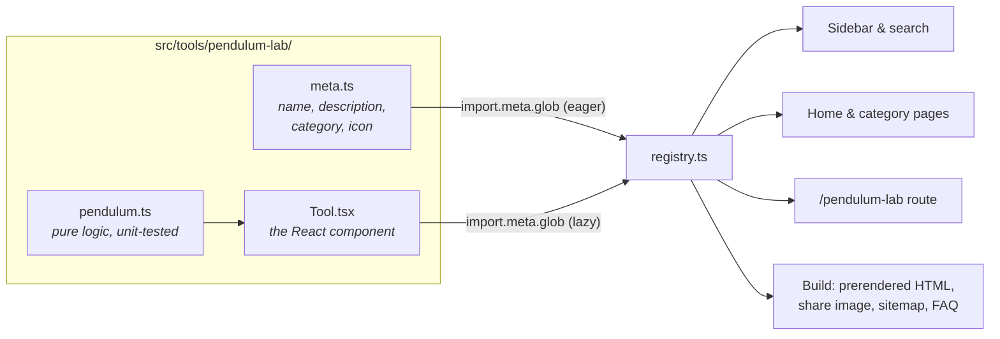

`src/tools/registry.ts` finds every folder with a `meta.ts` using Vite's `import.meta.glob`. Metadata is bundled eagerly (it's tiny and powers search), while each `Tool.tsx` becomes its own lazy chunk that downloads only when someone opens that tool.

### What `npm run build` does

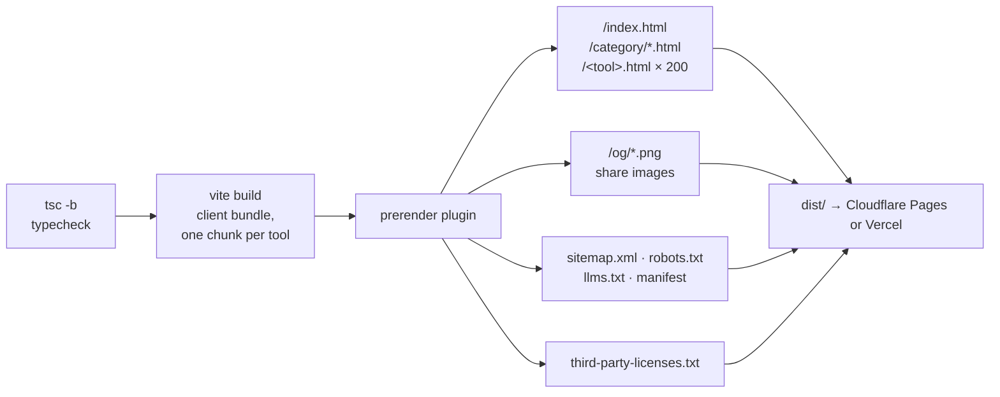

<details>
<summary><b>📁 Project layout</b></summary>

```text
4llTools/
├── index.html                 # Vite entry
├── vite.config.ts             # icon, licence and prerender plugins
├── build/seo-assets.ts        # draws share images and icons at build time
├── public/                    # _headers, favicon
├── docs/readme/               # images for this README (+ generate.mjs)
└── src/
    ├── main.tsx               # client entry
    ├── entry-server.tsx       # render() used by the prerender step
    ├── App.tsx                # routes: /, /category/:key, /:slug, legal pages
    ├── Home.tsx · CategoryPage.tsx · Sidebar.tsx
    ├── seo.ts                 # titles, descriptions, JSON-LD, FAQ
    ├── site.config.ts         # owner, contact, governing law
    ├── styles.css             # warm-paper theme, category hues, motion tokens
    ├── components/            # Icon (duotone Majesticons), CopyButton, ToolTile…
    ├── motion/                # springs, odometer digits, FLIP, sliding pills
    ├── legal/                 # privacy, terms, licences, about
    ├── sim/                   # the simulation kit (see below)
    └── tools/
        ├── registry.ts        # discovers every tool folder
        ├── types.ts           # ToolMeta and the Category list
        ├── <slug>/            # one folder per tool × 200
        │   ├── meta.ts
        │   ├── Tool.tsx
        │   └── *.ts           # pure logic
        └── *.test.ts          # grouped tests
```

</details>

## 🧩 The simulation kit

All 100 simulations share a small kit in [`src/sim/`](src/sim). It handles the fiddly parts (canvas sizing, the animation loop, pointer input, theming and reduced motion) so each simulation is mostly its own physics or algorithm.

<picture>
  <source media="(prefers-color-scheme: dark)" srcset="docs/readme/screens/tool-dark.webp">
  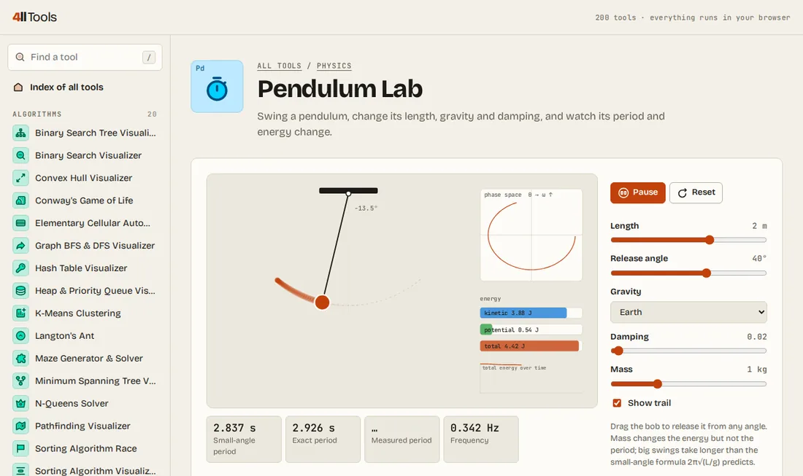
</picture>

| Module | What it gives you |
| --- | --- |
| [`Stage.tsx`](src/sim/Stage.tsx) | `<Stage world={[W, H]} running onFrame onPointer label />`: a canvas that draws in fixed **world units**, scales to fit at the device pixel ratio, runs a `requestAnimationFrame` loop, skips frames while scrolled out of view, and maps pointer events into world coordinates. |
| [`controls.tsx`](src/sim/controls.tsx) | `useRunning()`, `SimLayout`, `PlayBar` (play / pause / step / reset), `Slider`, `Toggle`, `Choice` (sliding pill buttons), `Select`, `Readout`, `Legend`, `Hint`. |
| [`draw.ts`](src/sim/draw.ts) | `circle`, `line`, `arrow`, `text`, `grid`, `chart`, `bars`, `rrect`, `makeBuffer` (fast per-pixel drawing), `downloadCanvas` (Save PNG). |
| [`math.ts`](src/sim/math.ts) | `rk4` integrator, seeded `rng`, `gaussian`, Perlin `makeNoise`, `histogram`, `mean`/`stdev`, `collide1D`, `niceStep`, `fmt` for readouts. |
| [`theme.ts`](src/sim/theme.ts) | `useTheme()` reads the site's CSS colours so canvases match light and dark mode; `alpha`, `hue`, `PALETTE`. |
| [`audio.ts`](src/sim/audio.ts) | `tone()` for optional sound effects (sorting beeps, Geiger clicks, cradle clacks). |

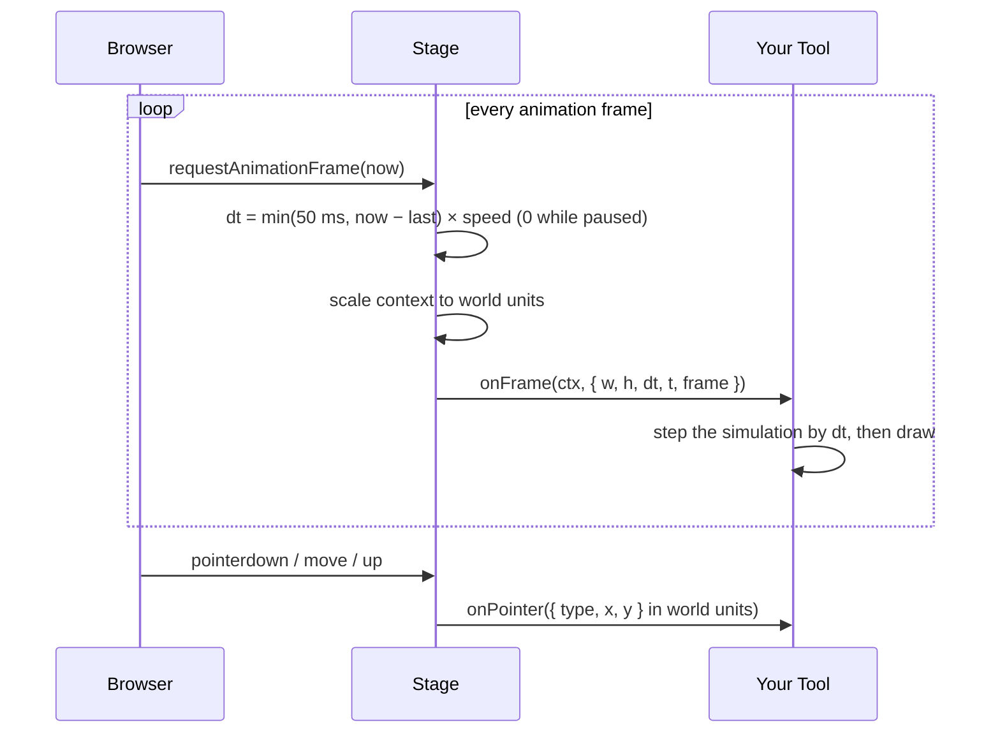

<details>
<summary><b>🧪 A complete simulation in ~40 lines</b></summary>

```tsx
import { useRef, useState } from 'react'
import Stage from '../../sim/Stage'
import { Hint, PlayBar, Readout, SimLayout, Slider, useRunning } from '../../sim/controls'
import { circle, clear } from '../../sim/draw'
import { fmt } from '../../sim/math'
import { useTheme } from '../../sim/theme'

export default function BouncingBall() {
  const theme = useTheme()
  const [running, setRunning] = useRunning()  // starts paused under reduced motion
  const [gravity, setGravity] = useState(900)
  const ball = useRef({ y: 60, v: 0 })        // mutable sim state lives in a ref
  const [height, setHeight] = useState(0)

  return (
    <SimLayout
      stage={
        <>
          <Stage
            world={[600, 400]}
            running={running}
            label="A ball bouncing on the floor"
            onPointer={(p) => p.type === 'down' && Object.assign(ball.current, { y: p.y, v: 0 })}
            onFrame={(ctx, f) => {
              const b = ball.current
              b.v += gravity * f.dt                       // dt is 0 while paused
              b.y += b.v * f.dt
              if (b.y > 380) [b.y, b.v] = [380, -b.v * 0.85]
              clear(ctx, f.w, f.h, theme.sunken)
              circle(ctx, 300, b.y, 20, theme.accent)
              if (f.frame % 10 === 0) setHeight(380 - b.y) // throttle React updates
            }}
          />
          <Readout items={[['Height', `${fmt(height, 0)} px`]]} />
        </>
      }
    >
      <PlayBar running={running} setRunning={setRunning} onReset={() => (ball.current = { y: 60, v: 0 })} />
      <Slider label="Gravity" value={gravity} min={100} max={2000} unit=" px/s²" onChange={setGravity} />
      <Hint>Click anywhere to drop the ball from there.</Hint>
    </SimLayout>
  )
}
```

</details>

<details>
<summary><b>📐 Conventions every simulation follows</b></summary>

- **Pure logic lives next to the component** (`pendulum.ts`, `sorts.ts`, `grayscott.ts`…) and is covered by the `src/tools/sims-*.test.ts` suites: energy conservation, known answers (27 takes 111 Collatz steps; 8 queens have 92 solutions; an AVL tree stays balanced) and invariants.
- **State split:** per-frame state in `useRef`, UI parameters in `useState`, and readouts pushed to React only every few frames.
- **Step-by-step algorithms are generators.** Each `yield` is one compare, swap or visit, and a speed slider decides how many run per frame. That makes *Step* and *Play* free.
- **Themed canvases:** colours come from `useTheme()` or a deliberately dark stage (`className="sim-dark"`), so both modes look right.
- **Accessible:** the canvas has a descriptive `label`, every control is a real button, slider or checkbox, and nothing moves on its own under `prefers-reduced-motion`.
- **Heavy maths stays light:** typed arrays, low-resolution pixel buffers scaled up, spatial grids for neighbour search, and a cap on `dt`, so a slow frame never makes the physics explode.

</details>

## 🔒 Privacy, network and motion

- **Local first.** Tools run on JavaScript in your tab. Camera, microphone and screen access (QR reader, webcam test, audio visualizer, screen recorder) are requested only when you use them and never leave your device.
- **Honest network use.** A tool that has to call out sets `network` in its `meta.ts`. That text appears in its FAQ and on the [privacy page](https://4lltools.morizdigital.com/privacy) instead of the usual "nothing leaves your device" promise.
- **No cookies.** A few tools remember small preferences (recent emoji, Pomodoro settings, time zones, typing best scores) in `localStorage`.
- **Motion.** Transitions use real spring physics pre-computed into CSS `linear()` easings (see `src/motion/springs.ts`). Under reduced motion, animations are removed and simulations start paused with a note explaining why.

## 🚀 Run it locally

Needs **Node.js 20+** (the build pins Node 22 in `.node-version`).

```bash
git clone https://github.com/mrzkprtm/4llTools.git
cd 4llTools
npm install
npm run dev      # dev server at http://localhost:5173
```

| Command | What it does |
| --- | --- |
| `npm run dev` | Start the Vite dev server with hot reload |
| `npm test` | Run every unit test once with Vitest |
| `npm run build` | Typecheck, bundle and prerender everything into `dist/` |
| `npm run preview` | Serve the production build locally |
| `node docs/readme/generate.mjs` | Redraw this README's banner, category chart and tool catalog |

CI ([`.github/workflows/ci.yml`](.github/workflows/ci.yml)) runs `npm test` and `npm run build` on every pull request and push to `main`.

## ➕ Add a new tool

Each folder in `src/tools/` is one tool. The folder name becomes its URL, and the home page picks it up automatically, so you never edit a central list.

1. Create `src/tools/my-tool/meta.ts`:

   ```ts
   import type { ToolMeta } from '../types'

   export const meta: ToolMeta = {
     name: 'My Tool',
     description: 'One sentence about what it does.',
     category: 'Text', // see Category in src/tools/types.ts
     keywords: ['extra', 'search', 'words'],
     symbol: 'Mt', // 1–3 characters, shown on the tool's tile
     icon: 'flask', // any Majesticons name (majesticons.com), without "-line"
   }
   ```

2. Create `src/tools/my-tool/Tool.tsx` with a default-exported React component. For a simulation, start from the [example above](#-the-simulation-kit) or copy `src/tools/pendulum-lab`.
3. Put any pure logic in its own file (like `format.ts`) and test it in `src/tools/my-tool/my-tool.test.ts`. Tool-specific styles can go in `src/tools/my-tool/tool.css`, imported from `Tool.tsx`, with class names prefixed to avoid clashes.
4. Run `node docs/readme/generate.mjs` to add it to the catalog and chart in this README.

The tool is now live at `/my-tool` and shows up in the sidebar, on the home page, in its category page and in the sitemap.

<details>
<summary><b>✅ Checks the test suite enforces</b></summary>

- Every tool has a **unique name** and a **unique 1–3 character symbol**.
- Its **icon** exists in Majesticons (the build fails otherwise, with a helpful message).
- Its page **title** fits in 70 characters and its **description** (plus the site's suffix) is 70–160 characters, so search results show it in full.
- Titles and descriptions are unique across the whole site.

</details>

## 🔎 SEO

`npm run build` prerenders every page, so search engines see real content without running JavaScript. Everything is generated from each tool's `meta.ts`, so a new tool gets all of it automatically:

- **Pages:** the home page, one page per tool, and one page per category at `/category/<key>`. Tool pages link to their category and to up to six related tools.
- **Tags:** its own title, description, canonical link, robots, Open Graph and Twitter tags.
- **Share images:** a 1200×630 PNG per tool, per category and for the home page (`/og/…`), drawn by `build/seo-assets.ts` with the site's font and category colors.
- **Structured data (JSON-LD):** `Organization`, `WebSite` and the category list on home. `CollectionPage` and breadcrumbs on categories. `WebApplication`, breadcrumbs and `FAQPage` on tools, matching the FAQ shown on the page.
- **Icons:** `favicon.ico`, `favicon.svg`, `apple-touch-icon.png`, manifest icons including a maskable one, and `site.webmanifest`.
- **Files for crawlers:** `sitemap.xml`, `robots.txt`, and `llms.txt` / `llms-full.txt` (a Markdown map of the tools for AI assistants).

If a tool sends anything over the network, set `network` in its `meta.ts` to say what goes where. Its FAQ then says that instead of promising the data stays on the device.

These environment variables in Cloudflare Pages (**Settings → Variables and Secrets**) change what is generated:

| Variable | What it does |
| --- | --- |
| `VITE_SITE_URL` | Site address for canonical links, share images and the sitemap. Defaults to `https://4lltools.morizdigital.com`. |
| `VITE_GOOGLE_SITE_VERIFICATION` | Adds Google Search Console's `google-site-verification` meta tag. |
| `VITE_BING_SITE_VERIFICATION` | Adds Bing Webmaster Tools' `msvalidate.01` meta tag. |
| `VITE_YANDEX_VERIFICATION` | Adds Yandex Webmaster's verification meta tag. |

After deploying, submit `https://<your domain>/sitemap.xml` in Google Search Console and Bing Webmaster Tools.

## 📦 Deploy

The build is a plain static folder (`dist/`), so any static host works. Both of these deploy every push to `main` and give pull requests preview links.

<details open>
<summary><b>☁️ Cloudflare Pages</b> (recommended)</summary>

1. In the Cloudflare dashboard go to **Workers & Pages → Create → Pages → Connect to Git** and pick this repository.
2. Use these build settings:
   - Framework preset: **Vite** (or None)
   - Build command: `npm run build`
   - Build output directory: `dist`
3. Click **Save and Deploy**. Every push to `main` deploys, and pull requests get preview links.

`.node-version` pins Node 22 for the build, which Vite needs. The build writes one HTML file per tool (`dist/qr-reader.html` and so on), which Pages serves at `/qr-reader`, and a `404.html` for unknown paths. `public/_headers` sends `X-Robots-Tag: noindex` on the `*.pages.dev` addresses (production and previews), so only the custom domain shows up in search. Pages sites are always HTTPS, which the camera needs.

</details>

<details>
<summary><b>▲ Vercel</b></summary>

1. Go to [vercel.com/new](https://vercel.com/new) and import this repository.
2. Vercel detects Vite on its own. Keep the defaults (build command `npm run build`, output folder `dist`) and click **Deploy**.
3. From then on, every push to `main` deploys automatically, and every pull request gets its own preview link.

`vercel.json` turns on clean URLs, so `/qr-reader` serves the prerendered `qr-reader.html`, and sends any other path to `index.html`. The camera needs HTTPS, which Vercel provides.

</details>

## 📜 Copyright and licences

© 2026 Moriz Digital. All rights reserved. The source is public so you can see how the tools work. That doesn't by itself grant a licence to reuse it; see the [licences page](https://4lltools.morizdigital.com/licenses).

4llTools is built on open-source libraries, icons and fonts (MIT, ISC, BSD, Apache-2.0, OFL and others). The build lists every one on the licences page and writes their full licence texts to [`/third-party-licenses.txt`](https://4lltools.morizdigital.com/third-party-licenses.txt). Also see the [privacy policy](https://4lltools.morizdigital.com/privacy), [terms of use](https://4lltools.morizdigital.com/terms) and [about page](https://4lltools.morizdigital.com/about).

## ❓ FAQ

<details>
<summary><b>Does anything I type or upload leave my device?</b></summary>

Not for 196 of the 200 tools. Four tools need the network, and each says so in its FAQ and on the privacy page: **DNS Lookup** and **CORS & Security Header Checker** query the address you enter, **HTTP Status Code Reference** can check a live URL, and **Speech to Text** uses your browser's speech service. They send only what that job needs, straight to the named service.

</details>

<details>
<summary><b>Why is a simulation paused when I open it?</b></summary>

Your system is set to reduce motion, so simulations wait for you to press **Play**. Everything else still works: drag, step and reset.

</details>

<details>
<summary><b>Can I save what I make?</b></summary>

Most art tools and several simulations have **Save PNG**. Converters and generators have copy and download buttons. Nothing is stored on a server, so download anything you want to keep.

</details>

<details>
<summary><b>Does it work on phones and tablets?</b></summary>

Yes. The layout collapses to one column, the tool list becomes a drawer, and every canvas takes touch input: drag with a finger wherever the desktop version uses the mouse.

</details>

<details>
<summary><b>How do I report a bug or ask for a tool?</b></summary>

Open an issue on [GitHub](https://github.com/mrzkprtm/4llTools/issues).

</details>
